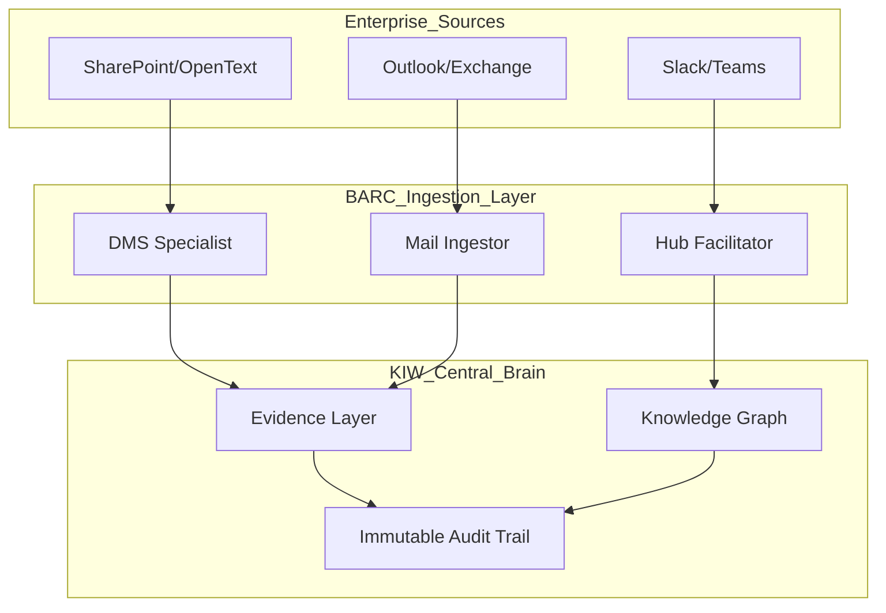

# Enterprise Integration Plugins: KIW Perspective

**Project**: BPO Architecture Review Copiolet (BARC)  
**Standard**: Knowledge Integration Workbench (KIW)  
**Focus**: Productivity Gains via Centralization and Automated Evidence Ingestion  

---

## 1. The Integration Philosophy
From the KIW perspective, enterprise integrations are not just "connectors"; they are **Agentic Sensory Organs**. Instead of human architects manually fetching data, the BARC platform proactively "listens" to the enterprise ecosystem to populate the Evidence Layer.

### Productivity Goal
**Minimize "Context Fragmentation"**: Shift from a 10-app workflow (Outlook, SharePoint, Slack, etc.) to a single unified "Decision Canvas" where all relevant artifacts are pre-categorized by agents.

---

## 2. Plugin Definitions

### 2.1. DMS (Document Management System) Plugin
- **Primary Function**: Semantic indexing and version reconciliation.
- **KIW Edge**: 
    - **Cross-Source Verification**: If a document in SharePoint says "Standard v2" but an email attachment says "Standard v3", the agent flags a **Consensus Conflict**.
    - **Metadata Inheritance**: Automatically maps SharePoint "Security Labels" to BARC "Governance Risk Levels".
- **Productivity Gain**: Eliminates manual download/upload cycles; keeps the evidence repository in sync with the enterprise source of truth.

### 2.2. Collaboration Hub Plugin (Slack/Teams)
- **Primary Function**: Conversation state extraction.
- **KIW Edge**: 
    - **Thread Summarization**: Compressed long architecture debates into "Decision Rationale" nodes.
    - **Action Item Mapping**: Automatically creates "Follow-up" tasks in the BARC workflow based on `@mentions` and "commitments" made in chat.
- **Productivity Gain**: Provides traceability for "Off-the-Record" decisions made in DM or channels.

### 2.3. Email Ingestion & Categorization Plugin
- **Primary Function**: Intelligent evidence extraction from unstructured mail.
- **Categorization Engine**: Uses KIW-grade LLMs to sort mail into:
    - **Category: Technical Evidence**: Configuration snippets, logs, topology diagrams.
    - **Category: Governance & Approvals**: Explicit "I approve" or "Waiver granted" statements.
    - **Category: Performance & Operations**: Weekly status reports, throughput metrics.
- **KIW Edge**: 
    - **Body-to-Artifact Conversion**: Extracts tables or lists from the email body and converts them into structured JSON artifacts.
    - **Confidence Scoring**: Assigns a weight (0.0 - 1.0) to evidence based on the sender's seniority and explicit language.
- **Productivity Gain**: Automates the "Triage" phase of architecture audits.

---

## 3. centralized Intelligence Architecture

---

## 4. Immediate Requirements for Development
1. **OAuth2 Handshake**: Secure vaulting for enterprise credentials.
2. **WebHook Listeners**: For real-time ingestion of chat/mail.
3. **Categorization Prompt Templates**: Specific system prompts for the Mail Ingestor to ensure high-precision filtering (Technical vs. Noise).

---

**Architect**: Antigravity AI  
**Tier**: KIW-Premium Integration
